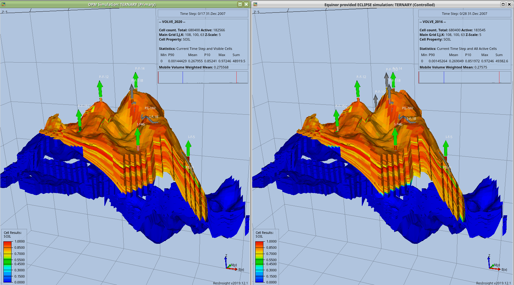

# Volve2OPM

Running the Volve Eclipse reservoir simulation using the OpenPorousMedia flow simulator.

This project is derived from the Equinor release of the Volve dataset.
The original data can be found here:
https://www.equinor.com/en/how-and-why/digitalisation-in-our-dna/volve-field-data-village-download.html

## Getting Started

OpenPorous media is installed by following the instructions found on the webpage. 

### Installing

In this work I have used the December 2019 version installed on Linux Mint 18.3 via the binary method outlined here:

https://opm-project.org/?page_id=245

### Running
To run the files execute the following command

```
    mpirun -np 8 flow VOLVE_2020.DATA

```

### Results
Here the OPM modified OPM simluation is compared directly with the Equnior provided model run with ECLIPSE.
There are some clear difference between the two (e.g. the Equinor model has additonal wells, modified permeability etc). However the results are very similar over this time scale.




## Authors

* [Chris Dinneen](https://github.com/dbiged)

## License

This project is licensed under the CC BY-NA-SA 4.0 License - see the [LICENSE.md](LICENSE.md) file for details

## Acknowledgments

* This project is derived from the Equinor release of the Volve dataset.
The original data can be found here:
https://www.equinor.com/en/how-and-why/digitalisation-in-our-dna/volve-field-data-village-download.html
* Thanks to [Tony Hallam](https://github.com/trhallam) for assistance in getting it running. 

